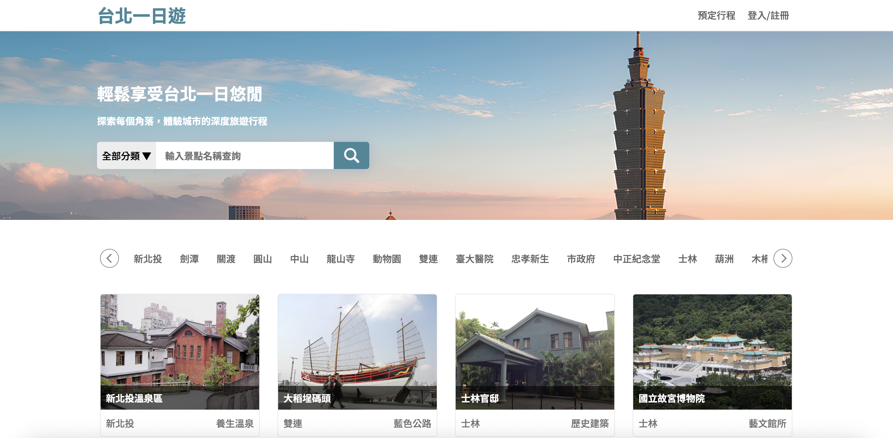

# 台北一日遊（Taipei Day Trip）



<br>

> 一個提供使用者搜尋台北景點、預訂一日旅遊行程並完成線上付款的網站。  


[🔗 臺北一日遊線上網站連結](http://3.113.238.56:8000/)


## 🔧 功能介紹

- 👤 使用者系統
    - 註冊帳號
    - 登入 / 登出
    - JWT 驗證
- 🗺️ 景點系統
    - 景點列表
    - 關鍵字搜尋
    - 分類篩選（景點類型／捷運站）
    - 景點詳細頁
- 🛒 預訂系統
    - 選擇日期／時段（早／午）
    - 自動計算價格
    - 建立或更新預訂
- 💳 訂單與金流
    - 建立訂單
    - TapPay 金流付款
    - 訂單狀態更新
    - 訂單查詢


## 🧭 使用流程

```

註冊 / 登入
↓
瀏覽景點（搜尋 / 分類）
↓
點擊景點查看詳細資訊
↓
選擇日期與時段加入預訂
↓
填寫聯絡資訊
↓
進行付款（TapPay）
↓
訂單完成

```

## 📂 資料夾結構

```
taipei-day-trip/
├── app.py                         # FastAPI 入口，註冊 API 與靜態頁面路由
├── requirements.txt               # Python 相依套件
├── .env.example                   # 環境變數範例
├── load_attractions.py            # 匯入景點資料腳本
├── controllers/                   # Controller 層：處理 request / response
│   ├── attraction_controller.py
│   ├── booking_controller.py
│   ├── order_controller.py
│   └── user_controller.py
│
├── models/                        # Model 層：資料庫查詢、商業邏輯、資料驗證
│   ├── attraction_model.py
│   ├── booking_model.py
│   ├── order_model.py
│   ├── user_model.py
│   ├── database.py
│   └── schemas.py
│
├── static/                        # 前端靜態資源
│   ├── templates/                 # HTML 頁面模板
│   │   ├── index.html
│   │   ├── attraction.html
│   │   ├── booking.html
│   │   └── thankyou.html
│   ├── image/                     # 圖片資源
│   ├── styles.css                 # 全站樣式
│   ├── main.js                    # 共用前端邏輯
│   ├── navigation.js              
│   ├── authorization.js 
│   ├── index.js
│   ├── attractions.js 
│   ├── booking.js
│   └── thankyou.js
├── data/                          # 原始資料或匯入資料
└── README.md
```

## 🛠️ 專案技術
### Backend
- FastAPI
- Python
- MySQL
### Frontend
- HTML
- CSS
- Vanilla JavaScript
### Authentication
- JWT（JSON Web Token）
- bcrypt
### Payment
- TapPay SDK（Sandbox）
### Deployment
- AWS EC2
